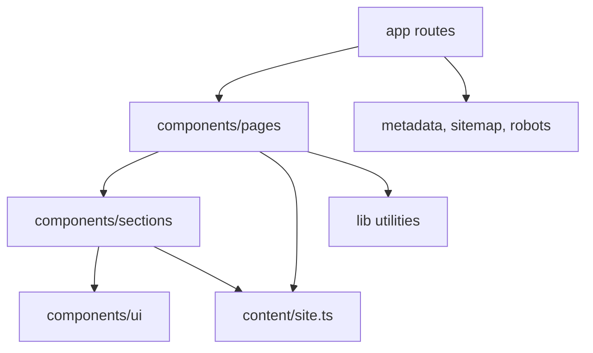
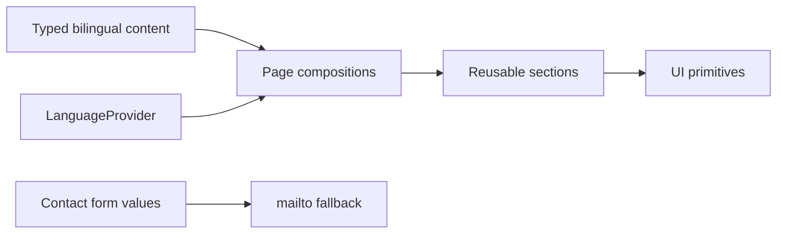

# Architecture

Miramar is a static-first Next.js App Router site. Pages import route-level
client compositions only where language switching, filtering, animation, form
validation, or the hero scene needs browser APIs.

## Data Flow

## Runtime Boundaries

- Server route files own metadata and static route generation.
- Client components handle language state, form validation, equipment filters,
  motion, and Three.js rendering.
- No paid API, database, CMS, or backend service is required.
