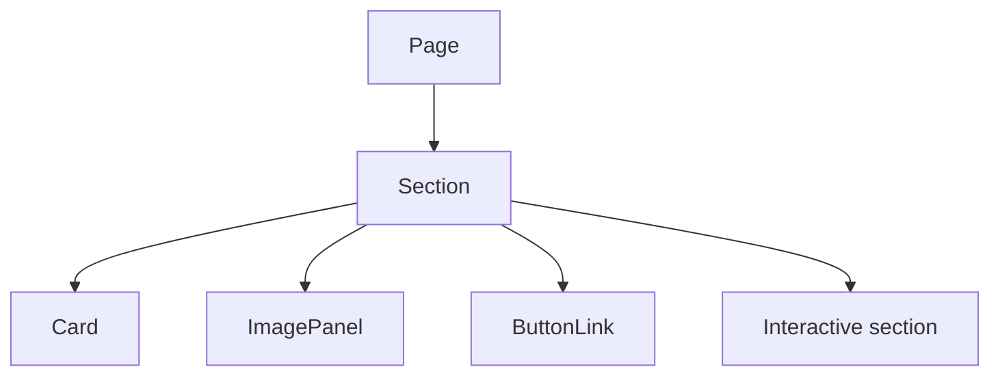

# Components

## Layout

- `SiteShell`: global site wrapper with language provider, nav, footer, and depth background.
- `Navbar`: responsive navigation, active route state, language controls.
- `Footer`: quick links, registered office, embedded map, legal/disclaimer text.

## UI

- `ButtonLink`: internal/external CTA component.
- `Card`: reusable industrial panel.
- `IconBadge`: consistent icon framing.
- `Section`, `SectionHeader`, `PageHero`: page rhythm and hero primitives.
- `Reveal`: reduced-motion aware Framer Motion reveal wrapper.

## Sections

- `HeroVisual`: lazy desktop 3D hero with static image fallback.
- `ServiceGrid`: material/electrical/plumbing service pillars.
- `ProcessFlow`: BOQ-to-handover project flow.
- `EquipmentFilter`: client-side category filtering.
- `ContactForm`: Zod + React Hook Form validation and real mailto fallback.

