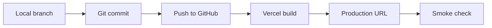

# Deployment

Miramar is designed for GitHub and Vercel free-tier deployment.

## Local Verification

```bash
npm install
npm run lint
npm run typecheck
npm run build
```

## Vercel Flow



## Environment Variables

No environment variables are required for the current production build. The
contact form intentionally uses a no-cost `mailto:` fallback. If real email
delivery is added later, document every required key here and add a matching
`.env.example`.

## Production Checks

- Confirm `https://miramartr.vercel.app` loads.
- Check all primary routes.
- Check sitemap: `/sitemap.xml`.
- Check robots: `/robots.txt`.
- Confirm mobile menu, language switch, equipment filters, and contact validation.
