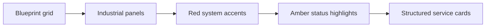

# Design System

The visual system is built for a high-end industrial company: quiet, technical,
and credible rather than decorative.

## Palette

- Graphite base: `#080b0e`, `#0d1217`
- Steel surfaces: `#111820`, `#17202a`, `#202b36`
- Safety red accent: `#b8202a`
- Amber highlight: `#f2b84b`
- Warm off-white text: `#f7f3eb`

## Interface Rules

- Use square-ish 8px radius panels and controls.
- Use cards for repeated content and framed tools only.
- Avoid fake metrics, clients, certifications, and placeholder claims.
- Keep CTAs direct: RFQ, BOQ, services, equipment, and contact.
- Respect `prefers-reduced-motion`.

## Visual Motifs

