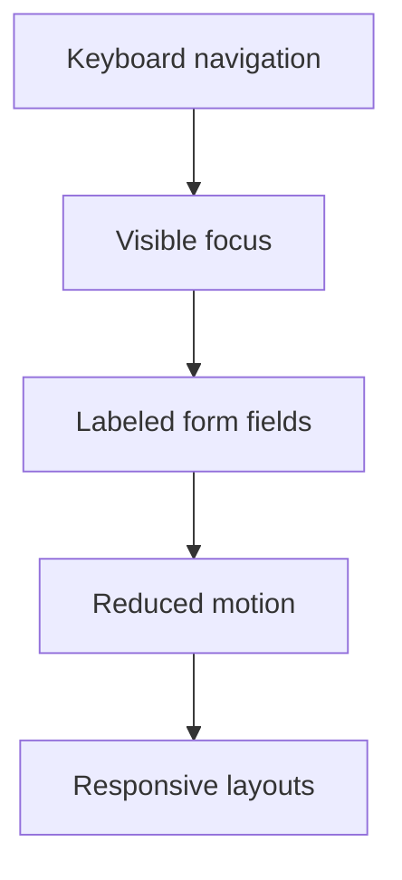

# SEO & Accessibility

## SEO

- Root metadata defines canonical URL, Open Graph, Twitter summary card, icons,
  and site description.
- Each page exports focused metadata.
- `app/sitemap.ts` and `app/robots.ts` are generated by Next.js.
- The content uses real Miramar facts only; no invented clients, certifications,
  team members, or performance claims.

## Accessibility

- Navigation uses semantic `header`, `nav`, and `main` landmarks.
- Footer uses `contentinfo`.
- Mobile menu exposes `aria-expanded` and `aria-controls`.
- Equipment filters use tab semantics.
- Form fields have labels and visible validation errors.
- Focus rings use amber contrast against the graphite background.
- Motion respects `prefers-reduced-motion`.

